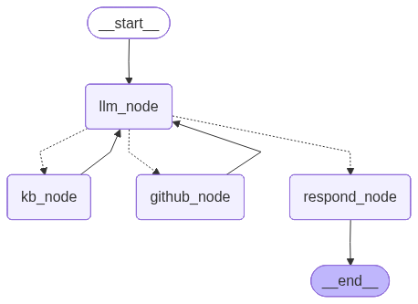

# Project_Mentor_Agent
This is a ReAct-based agent designed to support the development of a system or a software hosted in Github. In this case, i used Intelligent System for AutomaticCorrection and Completion for Short Text Exchange project by tightly integrating a knowledge base with live repository interaction.

## Graph Architecture

